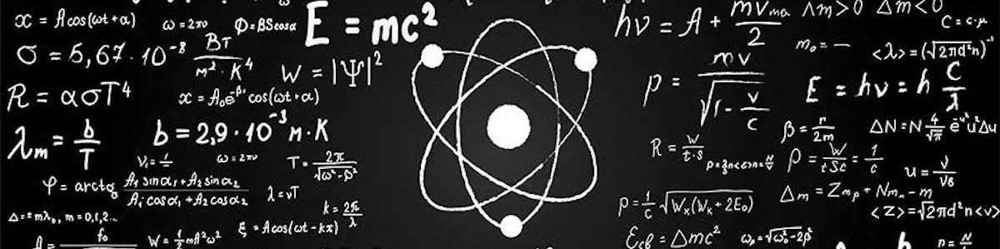

 

### Ph.D. in Physics - 2017  
 From 2014 to 2017, with a scholarship from Coordenação de Aperfeiçoamento de Pessoal de Nível Superior [(Capes)](https://www.capes.gov.br/), a Brazilian agency. I worked in the Laboratory of Organic Optoelectronic Devices (GOOD), under the supervision of [Prof. Ivo A. Hümmelgem](http://fisica.ufpr.br/pagina_ppgf_english/info_ivo.html), from the [Physics Department](http://fisica.ufpr.br/pagina_ppgf_english/) of [Universidade Federal do Parana](https://www.ufpr.br/portalufpr/).    

### Master in Physics - 2014  
 From 2012 to 2014, also with a scholarship from Coordenação de Aperfeiçoamento de Pessoal de Nível Superior [(Capes)](https://www.capes.gov.br/). The academic research was developed under supervision of [Prof. Holokx A. Albuquerque](https://www.udesc.br/professor/holokx.albuquerque), from the [Physics Department](https://www.udesc.br/cct/departamentos/fisica) of the [Universidade do Estado de Santa Catarina](https://www.udesc.br/international).    

### Bachelor in Physics - 2007  
 Bachelor degree in Physics from the [Universidade do Estado de Santa Catarina](https://www.udesc.br/international). From 2003 to 2007.   

   

