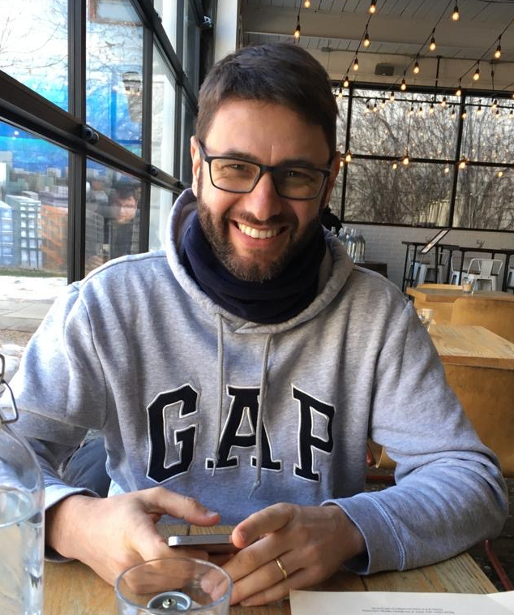

---

---

<link rel="stylesheet" href="styles.css" type="text/css">

:::: {style="display: grid; grid-template-columns: 35% 3% 62%; grid-column-gap: 0px;"}

::: {}
  

 
ANDERSON HOFF  

POSTDOCTORAL RESEARCHER  
PHYSICS

:::

::: {}

::: 

::: {}

  I love Physics, Mathematics, Statistics, Chemistry, and how we can use this knowledge to understand and explain almost every behaviour in a few lines. Also, I like to analyze data to answer research questions and test hypotheses. Currently, I work with chaotic time series analysis, and also in other data projects to improve my R programming and analysis skills. To have a big picture of my qualifications, take a look at my resume available [here](files/AndersonHoff_resume.pdf).  

In some words, I graduated from the [Universidade do Estado de Santa Catarina](https://www.udesc.br/cct/ppgf) with a BS and after an MS in Physics in 2014. In this same year, I began working toward my Ph.D. in Physics as a full-time research assistant at [Universidade Federal do Parana](http://fisica.ufpr.br/pagina_ppgf_english/), where I built and fully characterized organic and inorganic solar cells, under the advisement of [Prof. Ivo A. Hümmelgen](http://fisica.ufpr.br/pagina_ppgf_english/info_ivo.html). I obtained my Ph.D. at the end of 2017.

From 2018 to 2019 I worked a Physics and Mathematics Lecturer, and after as a Postdoctoral Researcher in the laboratory of [Prof. Holokx A. Albuquerque](https://www.udesc.br/professor/holokx.albuquerque), from the [Physics Department](https://www.udesc.br/cct/departamentos/fisica) of the [Universidade do Estado de Santa Catarina](https://www.udesc.br/international). My research was focused on chaotic time series analysis, obtained by electronic circuits and numerical simulations. That turned on as an incredible opportunity to use my laboratory skills and to master my programming skills, and I could learn more about R and Python. At this time I started using R, and I am now an R enthusiast.   

At the beginning of 2020, I moved from Brazil to Canada, and now I am based in London ON. 

:::

::::
