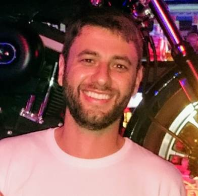

---
---

<link rel="stylesheet" href="styles.css" type="text/css">

I like to analyze data to answer research questions and test hypotheses. Currently I work with different sources to learn more about R programming and analysis. Also, I am working with Tableau in some data analysis.  

To have a big picture of my qualifications, take a look of my resume available [here](files/AndersonHoff_resume.pdf).  

In some words, I graduated from the [Universidade do Estado de Santa Catarina](https://www.udesc.br/cct/ppgf) with a BS and after a MS in Physics in 2014. In this same year I began working toward my PhD in Physics as a full-time research assistant at [Universidade Federal do Parana](http://fisica.ufpr.br/pagina_ppgf_english/), where I built and fully characterized organic and inorganic solar cells, under the advisement of [Dr. Ivo A. Hümmelgen](http://fisica.ufpr.br/pagina_ppgf_english/info_ivo.html). I obtained my PhD in the end of 2017.

In 2018 I started a postdoctorate at [Universidade do Estado de Santa Catarina](https://www.udesc.br/cct/ppgf), with a research in chaotic time series, when I had to use several programming skills and could learn more about R and Python. At this time I started using R, and I am now an R enthusiast.   

In the beggining of 2020 I moved from Brazil to Canada, and now I am based in Toronto ON.  

