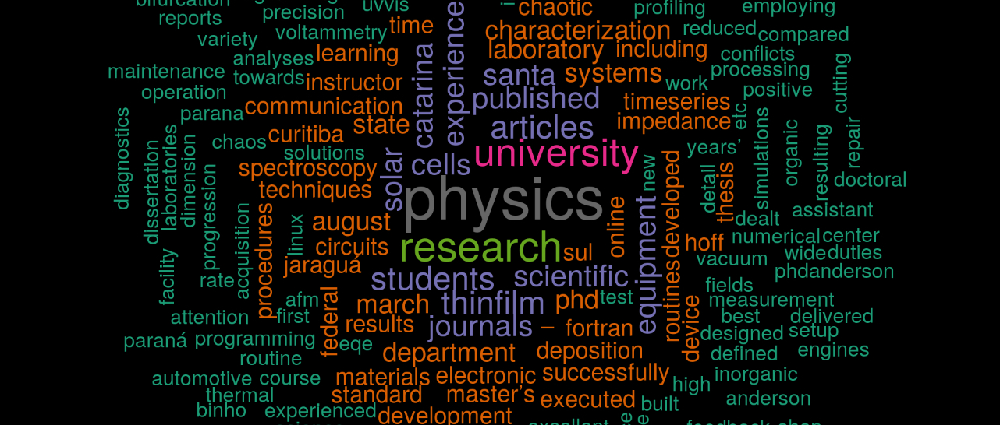

 In my past research activities, I needet to use different programming languages, as C++, Fortran, GnuPlot, Shell, Python, R. In general, I only learned the sufficient to solve my research challenges at each particular moment. The main difference now is that I really enjoyed R, and I am going deeper in this field to use it as a work tool.  

Below there is a summary of my works, available on [GitHub](https://github.com/AndersonHoff).  
 
[COVID-19](https://github.com/AndersonHoff/Covid19)  
My first Shiny App, where I plot the data and some analysis related to the Covid-19 pandemic. The app can be seen [here](https://anderson-hoff.shinyapps.io/Covid19/).  

[ChaoticTimeSerieswithR](https://github.com/AndersonHoff/ChaoticTimeSerieswithR)   
Routines which I developed during my postdoctoral research to identify chaotic behavior in experimental and simulated time series (still in development).  

[Upvotes analysis](https://github.com/AndersonHoff/Upvotes_analysis)  
Some data analysis and machine learning experiments to predict the number of upvotes for answers questions. The analysis is developed in RMarkdown, and can be seen [here](files/Upvotes.html).  

 

 Below, the WorldCount made in R, with the text extracted from my resume. As can be seen, "data analysis", "Physics" and "research" are the most cited words, which makes sense looking for my past experience.     

 