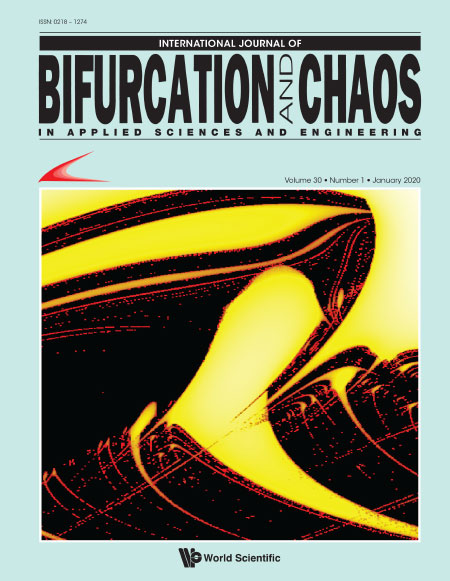

  

 The complete list of publications with their respective scitations can be seen in my [Google Sholar](https://scholar.google.com/citations?user=oV62NPgAAAAJ&hl=pt-BR).

   
 
### -2020-

  

Lucas A.S. Rosa, Flavio Prebianca, **Anderson Hoff**, Cesar Manchein, Holokx A. Albuquerque. 2020. Characterizing the Dynamics of the Watt Governor System Under Harmonic Perturbation and Gaussian Noise, *International Journal of Bifurcation and Chaos 30, No. 01, 2030001*.  
<i class="fa fa-file"></i> [doi:10.1142/S0218127420300013](https://www.worldscientific.com/doi/abs/10.1142/S0218127420300013)

Featured Article, and our result is the cover of [International Journal of Bifurcation and Chaos 30-01](https://www.worldscientific.com/toc/ijbc/30/01). 

  

 

### -2019-  

 
 
**Anderson Hoff**, Isidro Cruz-cruz, Mariana C. Siqueira, Kleber D. Machado, Ivo A. Hümmelgen. 2019. GaxSe10-x based solar cells: Some alternatives for the improvement in their performance parameters, *Solar Energy Materials and Solar Cells 193, 141–148*.  
<i class="fa fa-file"></i>[doi:10.1016/j.solmat.2019.01.002](https://www.sciencedirectcom/science/article/pii/S0927024819300029)

Nathan S. Nicolau, Tulio M. Oliveira, **Anderson Hoff**, Holokx A. Albuquerque, Cesar Manchein. 2019. Tracking multistability in the parameter space of a Chua’s circuit model, *The European Physical Journal B 92, No. 106*.   
<i class="fa fa-file"></i>[doi:10.1140/epjb/e2019-90749-x](https://link.springer.com/article/10.1140/epjb/e2019-90749-x)

 

### -2017-  

 

**Anderson Hoff**, Isidro Cruz-cruz, Mariana C. Siqueira, Kleber D. Machado, Ivo A. Hümmelgen. 2017. Influence of an interfacial cesium oxide thin layer in the performance and internal dynamic processes of GaSe9 solar cells, *Solar Energy Materials and Solar Cells 171, 1–7*.  
<i class="fa fa-file"></i>[doi:10.1016/j.solmat.2017.06.014](https://www.sciencedirect.com/science/article/pii/S0927024817303215)  

Mariana C. Siqueira, **Anderson Hoff**, Criatiane De Col, Kleber D. Machado, Ivo A. Hümmelgen, Jose P.M. Serbena. 2017. Enhancement of P3HT organic photodiodes by the addition of a GaSe9 alloy thin layer, *Semiconductor Science and Technology 32, No. 8*.  
<i class="fa fa-file"></i>[doi:10.1088/1361-6641/aa74fe](https://iopscience.iop.org/article/10.1088/1361-6641/aa74fe/meta)

David W.C. Marcondes, Guilherme F. Comassetto, Bruna G. Pedro, Jose C.C. Vieira, **Anderson Hoff**, Flavio Prebianca, Cesar Manchein, Holokx A. Albuquerque. 2017. Extensive Numerical Study and Circuitry Implementation of the Watt Governor Model, *International Journal of Bifurcation and Chaos 27, No. 11 *.  
<i class="fa fa-file"></i>[doi:10.1142/S0218127417501759](https://www.worldscientific.com/doi/abs/10.1142/S0218127417501759)

  
 
### -2016-

 

**Anderson Hoff**, Isidro Cruz-cruz, Mariana C. Siqueira, Kleber D. Machado, Ivo A. Hümmelgen. 2016. Morphological, optical and electrical properties of GaSe9 films and its application in photovoltaic devices, *Journal of Materials Science: Materials in Electronics 28, 2241-2249*.  
 <i class="fa fa-file"></i>[doi:10.1007/s10854-016-5794-5](https://link.springer.com/article/10.1007/s10854-016-5794-5) 

### -2014-

  
 
**Anderson Hoff**, Denilson T. Da Silva, Cesar Manchein, Holokx A. Albuquerque. 2014. Bifurcation structures and transient chaos in a four-dimensional Chua model, *Physics Letters A 378, 171–177*.   
<i class="fa fa-file"></i>[doi:10.1016/j.physleta.2013.11.003](https://www.sciencedirect.com/science/article/pii/S0375960113010384)  

**Anderson Hoff**, Juliana V. dos Santos, Cesar Manchein, Holokx A. Albuquerque. 2014. Numerical bifurcation analysis of two coupled FitzHugh-Nagumo oscillators, *The European Physical Journal B 87, 1–9*.  
<i class="fa fa-file"></i>[doi:10.1140/epjb/e2014-50170-9](https://link.springer.com/article/10.1140/epjb/e2014-50170-9)

 